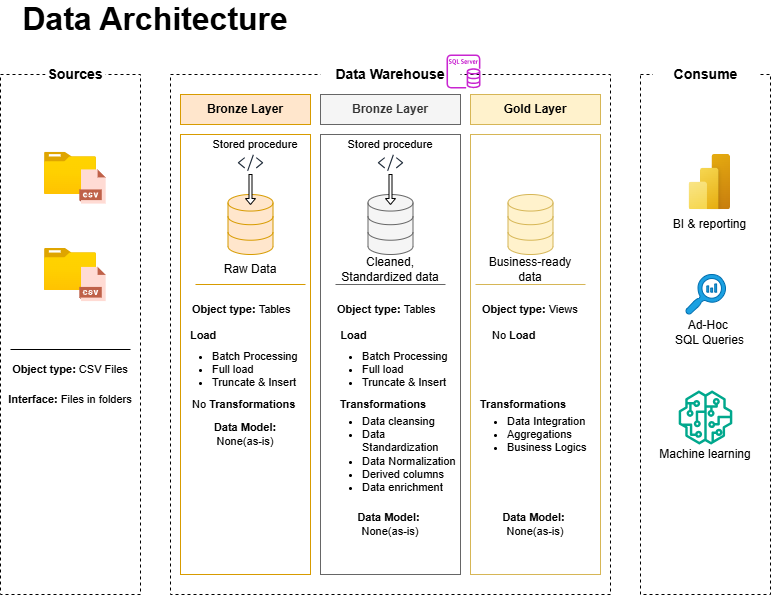

# SQL Data Warehouse Project: Medallion Architecture

This project demonstrates the end-to-end construction of a modern Data Warehouse using SQL Server. It implements a **Medallion Architecture** (Bronze, Silver, Gold layers) to process, clean, and transform raw CRM and ERP data into a structured format optimized for analytics and business intelligence.



## Project Overview

### Data Flow


### Data Integration


### Data Mart Design


## Project Architecture

The data warehouse follows a three-layer architecture:

1.  **Bronze (Raw Layer):** Holds the raw data as-is from source systems (CRM and ERP).
2.  **Silver (Cleaned Layer):** Contains cleaned and standardized data. Transformations include handling nulls, trimming strings, normalizing categories (Gender, Marital Status), data type conversions, and resolving duplicates using `ROW_NUMBER()`.
3.  **Gold (Analytics Layer):** Final presentation layer implementing a **Star Schema** with Fact and Dimension tables. It includes **SCD Type 2** logic for history tracking in dimensions.

## Directory Structure
```
├── Docs/
│   ├── Data_Catalog.md               # Detailed Data Dictionary
│   ├── Data flow.drawio.png           # Data flow diagram
│   ├── Data Mart.drawio.png           # Data mart design
│   ├── Data_achitecture.drawio.png    # Architectural diagram
│   └── Data_integration.drawio.png    # Integration workflow
├── Datasets/
│   └── datasets/                     # Source CSV files
│       ├── source_crm/               # CRM source data (Customers, Products, Sales)
│       └── source_erp/               # ERP source data (Cust_AZ12, Loc_A101, PX_Cat_G1V2)
├── Scripts/
│   ├── init_full_load.sql            # Master Orchestration Script (SQLCMD)
│   ├── init_database.sql             # Script to initialize DB and schemas
│   ├── bronze/                       # Bronze layer DDL and Load scripts
│   ├── silver/                       # Silver layer DDL and transformation scripts
│   └── gold/                         # Gold layer DDL (Fact and Dimensions)
└── tests/                            # Quality assurance and validation checks
```

## Getting Started

### Prerequisites

*   SQL Server (Express, Standard, or Developer edition)
*   SQL Server Management Studio (SSMS) or Azure Data Studio

### One-Click Deployment
To deploy the entire warehouse and load all data, run the master script using SQLCMD mode in SSMS:
```sql
:r "Scripts/init_full_load.sql"
```

### Manual Setup Instructions

1.  **Initialize Database:**
    Run `Scripts/init_database.sql` to create the `DataWarehouse` database and the `bronze`, `silver`, and `gold` schemas.

2.  **Bronze Layer:**
    Execute `Scripts/bronze/ddl_bronze.sql` then `Scripts/bronze/bronze_load_proc.sql`. Run `EXEC bronze.load_bronze` to ingest raw CSV data.

3.  **Silver Layer:**
    Execute `Scripts/silver/ddl_silver.sql` then `Scripts/silver/silver_load_proc.sql`. Run `EXEC silver.silver_load` to process and clean data.

4.  **Gold Layer:**
    Execute `Scripts/gold/ddl_gold.sql` to create the final analytical views (Star Schema).

## Key Features

*   **Medallion Architecture:** Logical separation for data quality and scalability.
*   **Master Orchestration:** Automated deployment script for easy environment setup.
*   **Advanced SQL Techniques:** Use of Window Functions (`ROW_NUMBER`), CTEs, and SCD Type 2 logic.
*   **Data Quality:** Dedicated `tests/` scripts for checking uniqueness, nulls, and schema consistency.
*   **Comprehensive Documentation:** Full Data Catalog and visual architecture diagrams.

## Future Enhancements & Roadmap

### Phase 1: Cloud Migration (Azure/AWS)
*   **Data Lake Transition:** Move source CSV files to ADLS Gen2 or AWS S3.
*   **Cloud Compute:** Migrate to Azure SQL DB or Amazon RDS for scalability.
*   **Serverless Ingestion:** Utilize Azure Data Factory (ADF) for cloud-native orchestration.

### Phase 2: Orchestration & Automation
*   **CI/CD Pipelines:** Implement GitHub Actions for automated SQL linting and deployment.
*   **Scheduling:** Use Airflow or ADF Triggers to automate daily data refreshes.

### Phase 3: Analytics & BI
*   **Visualization:** Connect the Gold layer to Power BI for interactive dashboards.
*   **Advanced Modeling:** Implement Predictive Analytics on top of the Gold fact tables.
